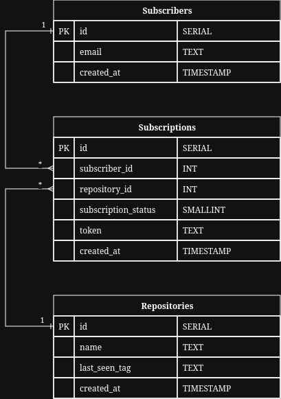

# ADR 0002: Data Persistence

* **Status:** Accepted
* **Author:** Oleh Volkoboi
* **Date:** 2026-05-08

## Context
The application needs to store persistent data for subscribers, repositories being tracked, and the subscriptions linking them.

## Proposed Options

### Option 1: PostgreSQL
- **Pros:** Strong consistency, ACID compliance, excellent Go integration, support for complex queries and relations.
- **Cons:** Requires a separate database server.

### Option 2: MySQL
- **Pros:** Performance for simple read-heavy workloads, very common.
- **Cons:** Slightly less advanced feature set for complex data types compared to PostgreSQL.

### Option 3: MongoDB
- **Pros:** Flexible schema, easy horizontal scaling.
- **Cons:** Lack of foreign keys and rigid relations makes the subscriber-repository link harder to manage reliably.

### Option 4: SQLite
- **Pros:** Zero configuration, file-based.
- **Cons:** Limited write concurrency; not ideal for services that might scale beyond a single instance.

## Decision
We chose **Option 1: PostgreSQL** for its robustness, strong support for relational integrity, and overall compatibility with the Go ecosystem.

### Schema
The database uses a normalized relational schema to maintain data integrity and avoid duplication.

> [!TIP]
> The diagram above is an "Editable PNG". To modify it, download the file and export to [drawio](https://drawio.com/).

1.  **subscribers**: Stores unique user emails.
2.  **repositories**: Stores unique GitHub repositories (stored as `owner/repo` in the `name` column) and their last known release tag.
3.  **subscriptions**: Table with subscribtions that links subscribers to the repositories they are watching. It includes a unique `token` for managing the subscription (e.g., for unsubscription links) and a `subscription_status`.

### Data Retention
We decided on **No Immediate Deletion** for inactive records. Even if a subscription is removed, the associated `subscriber` and `repository` records are retained. This prioritizes efficiency for re-subscriptions and preserves historical context for future analytics. We can implement a periodic cleanup task later if database bloat becomes a concern.

## Consequences
- **Pros:**
    - Relational model fits the domain perfectly.
    - Ensures data integrity via foreign keys and constraints.
    - Facilitates clear and efficient queries.
- **Cons:**
    - Requires managing a database server.
    - Normalization necessitates JOIN operations.
