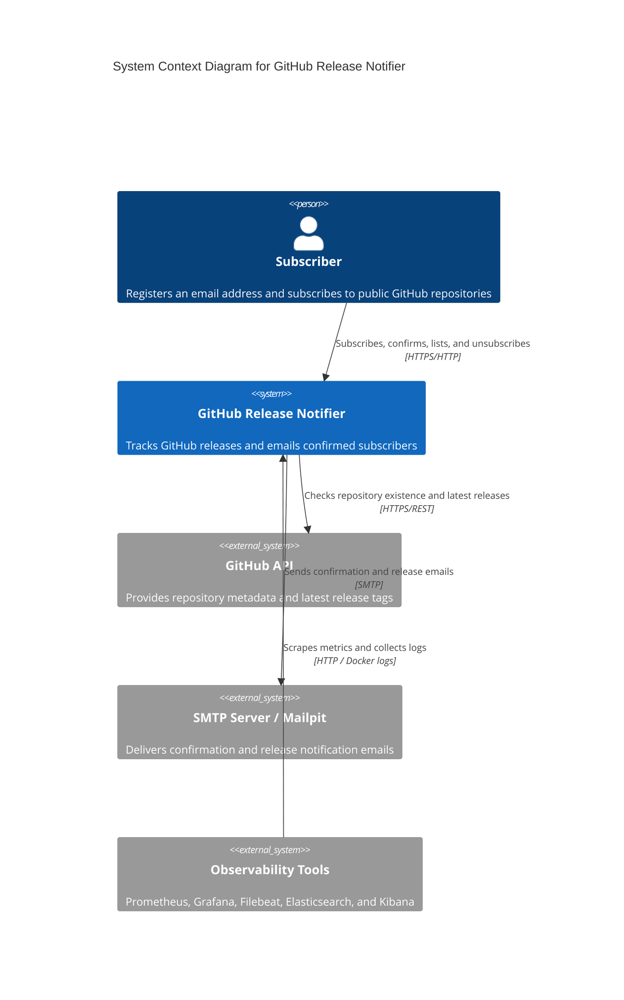
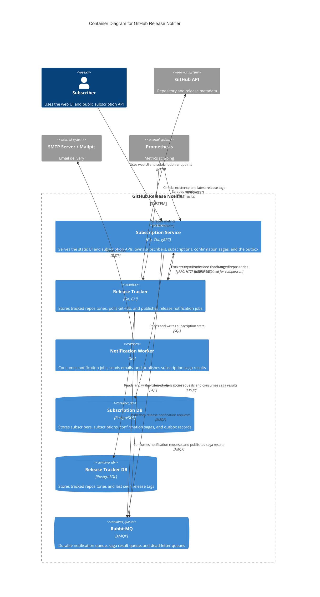
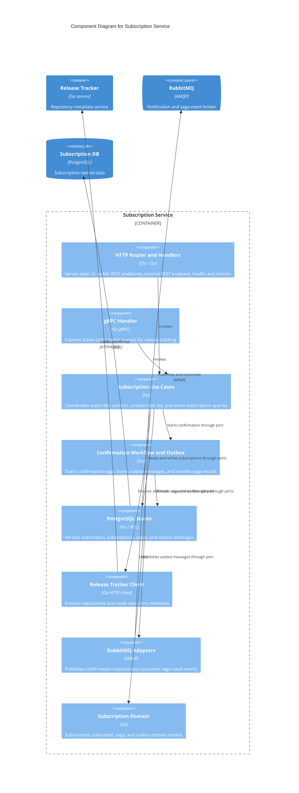
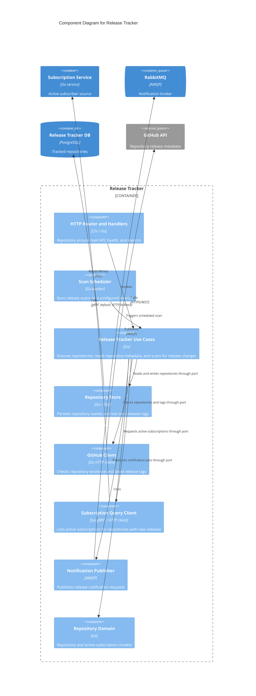
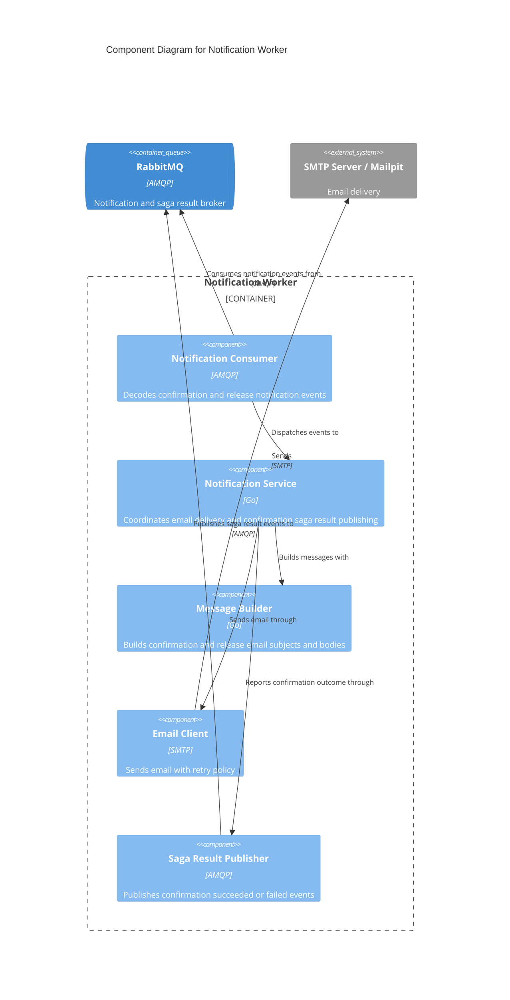

# Architecture

This document describes the current architecture of GitHub Release Notifier using the C4 model. The diagrams reflect the Docker Compose deployment and the Go modules under `services/` and `shared/`.

## Level 1: System Context

The system lets users subscribe to GitHub repositories, confirms subscriptions by email, periodically checks GitHub releases, and sends release notifications.

## Level 2: Containers

The application is split into independently deployable services. Each stateful service owns its database. Cross-service business events use RabbitMQ, while synchronous repository and subscription queries use HTTP or gRPC.

## Level 3: Subscription Service Components

The subscription service uses vertical module slices. Transport adapters call use cases, use cases depend on ports, and infrastructure adapters are wired in the composition root.

## Level 3: Release Tracker Components

The release tracker owns repository tracking and scanning. The subscription query client is selected in the composition root; gRPC is the current default and HTTP remains available for comparison.

## Level 3: Notification Worker Components

The notification worker has no database. It consumes durable events, sends emails, and reports confirmation success or failure back to the subscription saga.

## Layering and Dependency Rules

The service code follows these dependency directions:

- `cmd/server`: composition root; may depend on all concrete packages to wire the process.
- `transport`: HTTP and gRPC adapters; may depend on use cases and domain models, but not persistence or event-bus adapters.
- `usecase`: application operations; may depend on domain models and local ports/interfaces, but not concrete infrastructure adapters.
- `workflow`: application workflows such as confirmation saga and outbox relay; may depend on domain models and shared event contracts, but not concrete infrastructure adapters.
- `domain`: business state and invariants; must not depend on service infrastructure packages.
- `persistence` and `adapters`: concrete PostgreSQL, RabbitMQ, GitHub, SMTP, and cross-service clients; implement ports and may depend inward on domain/usecase contracts.
- `shared/contracts` and `shared/messaging`: shared event, protobuf, and RabbitMQ utility modules used across service boundaries.

The `.go-arch-lint.yml` rules enforce the most important import boundaries as part of `make arch-lint` and `make lint`.
