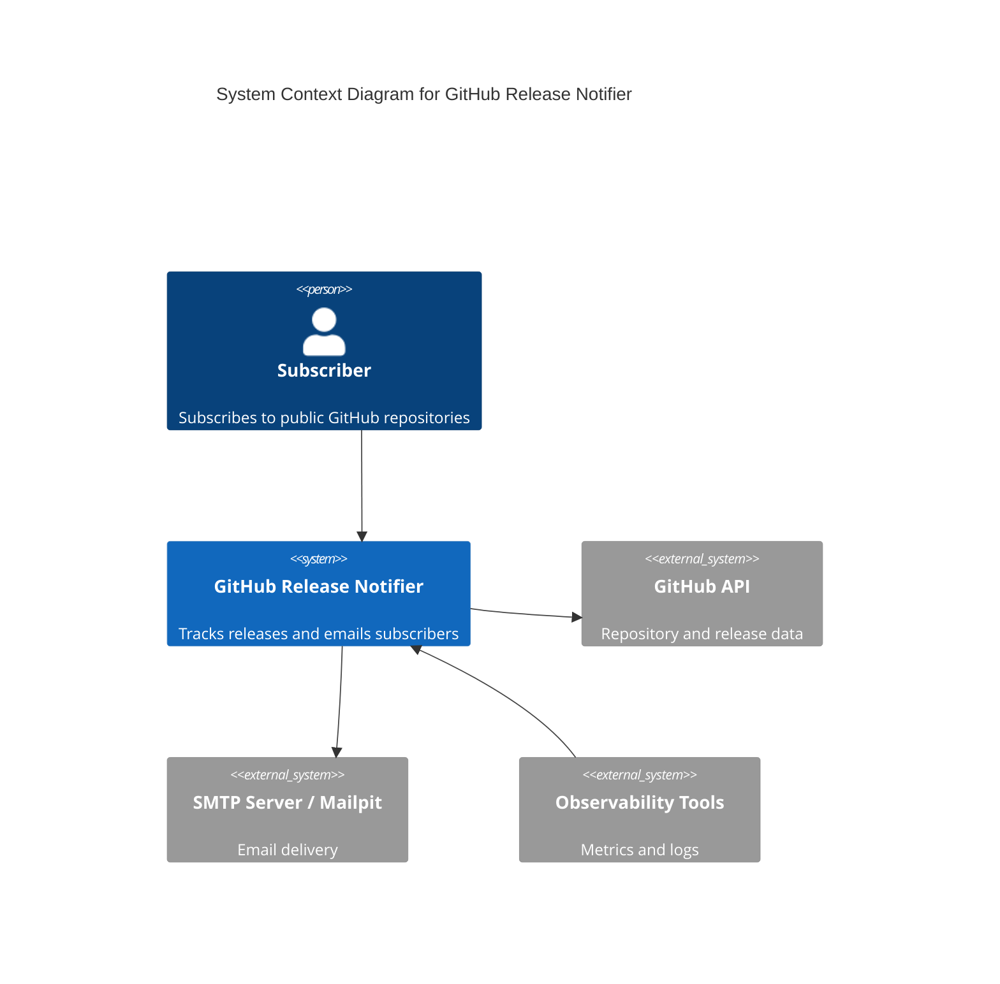
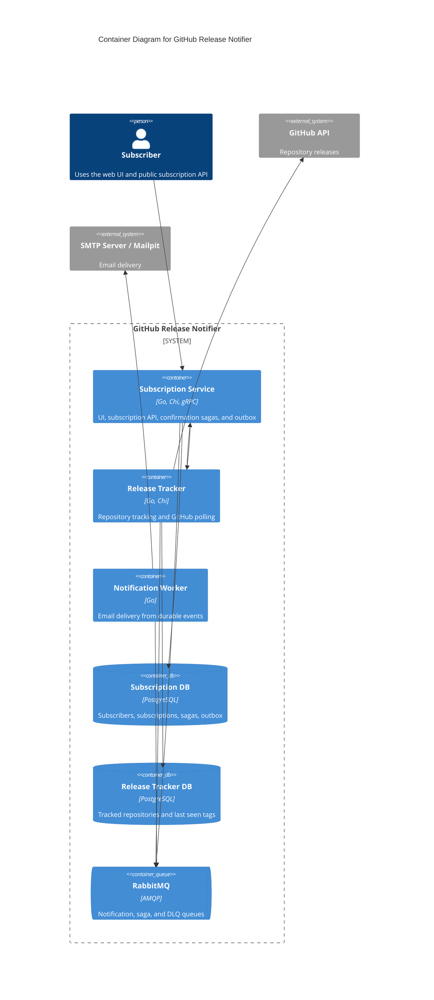
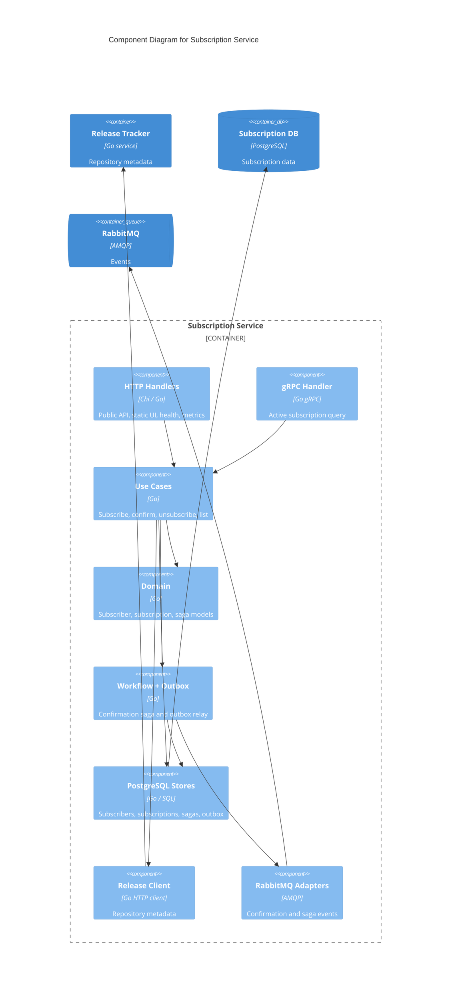
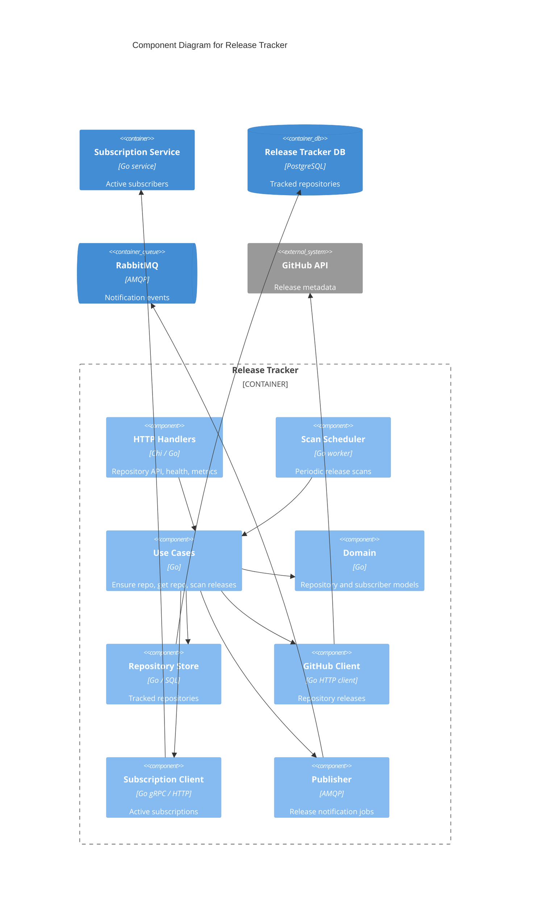
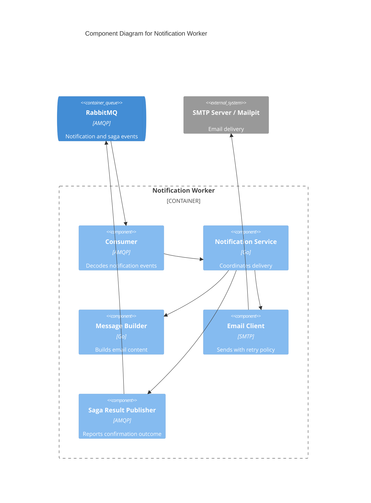

# Architecture

This document describes the current architecture of GitHub Release Notifier using the C4 model. The diagrams reflect the Docker Compose deployment and the Go modules under `services/` and `shared/`.

## Level 1: System Context

The system lets users subscribe to GitHub repositories, confirms subscriptions by email, periodically checks GitHub releases, and sends release notifications.

| From | To | Interaction |
| --- | --- | --- |
| Subscriber | GitHub Release Notifier | Uses web UI and subscription endpoints over HTTP |
| GitHub Release Notifier | GitHub API | Reads repository and release data over HTTPS/REST |
| GitHub Release Notifier | SMTP Server / Mailpit | Sends confirmation and release emails over SMTP |
| Observability Tools | GitHub Release Notifier | Reads metrics and logs |

## Level 2: Containers

The application is split into independently deployable services. Each stateful service owns its database. Cross-service business events use RabbitMQ, while synchronous repository and subscription queries use HTTP or gRPC.

| From | To | Interaction |
| --- | --- | --- |
| Subscriber | Subscription Service | Uses static UI and public subscription endpoints over HTTP |
| Subscription Service | Release Tracker | Ensures repositories and reads metadata over HTTP |
| Release Tracker | Subscription Service | Reads active subscribers over gRPC; HTTP adapter remains for comparison |
| Subscription Service | Subscription DB | Reads and writes subscribers, subscriptions, sagas, and outbox records over SQL |
| Release Tracker | Release Tracker DB | Reads and writes tracked repositories over SQL |
| Release Tracker | GitHub API | Polls latest release tags over HTTPS |
| Subscription Service | RabbitMQ | Publishes confirmation events and consumes saga results over AMQP |
| Release Tracker | RabbitMQ | Publishes release notification events over AMQP |
| Notification Worker | RabbitMQ | Consumes notification events and publishes saga results over AMQP |
| Notification Worker | SMTP Server / Mailpit | Sends emails over SMTP |

Observability containers are available through the Compose `observability` profile and scrape `/metrics` from the Go services.

## Level 3: Subscription Service Components

The subscription service uses vertical module slices. Transport adapters call use cases, use cases depend on ports, and infrastructure adapters are wired in the composition root.

| From | To | Interaction |
| --- | --- | --- |
| HTTP Handlers | Use Cases | Calls subscription use cases |
| gRPC Handler | Use Cases | Calls active-subscription query use case |
| Use Cases | Domain | Uses subscription, subscriber, and saga models |
| Use Cases | Workflow + Outbox | Starts confirmation saga through a port |
| Workflow + Outbox | PostgreSQL Stores | Persists saga and outbox state |
| Use Cases | PostgreSQL Stores | Reads and writes subscription state |
| Use Cases | Release Client | Ensures repositories and reads metadata |
| Release Client | Release Tracker | Calls repository APIs over HTTP |
| PostgreSQL Stores | Subscription DB | Reads and writes data over SQL |
| Workflow + Outbox | RabbitMQ Adapters | Publishes confirmation events |
| RabbitMQ Adapters | RabbitMQ | Uses AMQP |

## Level 3: Release Tracker Components

The release tracker owns repository tracking and scanning. The subscription query client is selected in the composition root; gRPC is the current default and HTTP remains available for comparison.

| From | To | Interaction |
| --- | --- | --- |
| HTTP Handlers | Use Cases | Calls repository ensure/read use cases |
| Scan Scheduler | Use Cases | Triggers periodic release scans |
| Use Cases | Domain | Uses repository and active-subscriber models |
| Use Cases | Repository Store | Reads and writes tracked repositories |
| Repository Store | Release Tracker DB | Reads and writes data over SQL |
| Use Cases | GitHub Client | Checks repository existence and latest tags |
| GitHub Client | GitHub API | Calls GitHub over HTTPS |
| Use Cases | Subscription Client | Requests active subscribers for changed repositories |
| Subscription Client | Subscription Service | Calls gRPC by default; HTTP client is retained |
| Use Cases | Publisher | Publishes release notification jobs |
| Publisher | RabbitMQ | Uses AMQP |

## Level 3: Notification Worker Components

The notification worker has no database. It consumes durable events, sends emails, and reports confirmation success or failure back to the subscription saga.

| From | To | Interaction |
| --- | --- | --- |
| RabbitMQ | Consumer | Delivers notification events over AMQP |
| Consumer | Notification Service | Dispatches decoded events |
| Notification Service | Message Builder | Builds email subject and body |
| Notification Service | Email Client | Sends email requests |
| Email Client | SMTP Server / Mailpit | Sends email over SMTP |
| Notification Service | Saga Result Publisher | Reports confirmation outcome |
| Saga Result Publisher | RabbitMQ | Publishes saga result events over AMQP |

## Layering and Dependency Rules

The service code follows these dependency directions:

- `cmd/server`: composition root; may depend on all concrete packages to wire the process.
- `transport`: HTTP and gRPC adapters; may depend on use cases and domain models, but not persistence or event-bus adapters.
- `usecase`: application operations; may depend on domain models and local ports/interfaces, but not concrete infrastructure adapters.
- `workflow`: application workflows such as confirmation saga and outbox relay; may depend on domain models and shared event contracts, but not concrete infrastructure adapters.
- `domain`: business state and invariants; must not depend on service infrastructure packages.
- `persistence` and `adapters`: concrete PostgreSQL, RabbitMQ, GitHub, SMTP, and cross-service clients; implement ports and may depend inward on domain/usecase contracts.
- `shared/contracts` and `shared/messaging`: shared event, protobuf, and RabbitMQ utility modules used across service boundaries.

The layering rules above document the intended dependency direction between packages.
