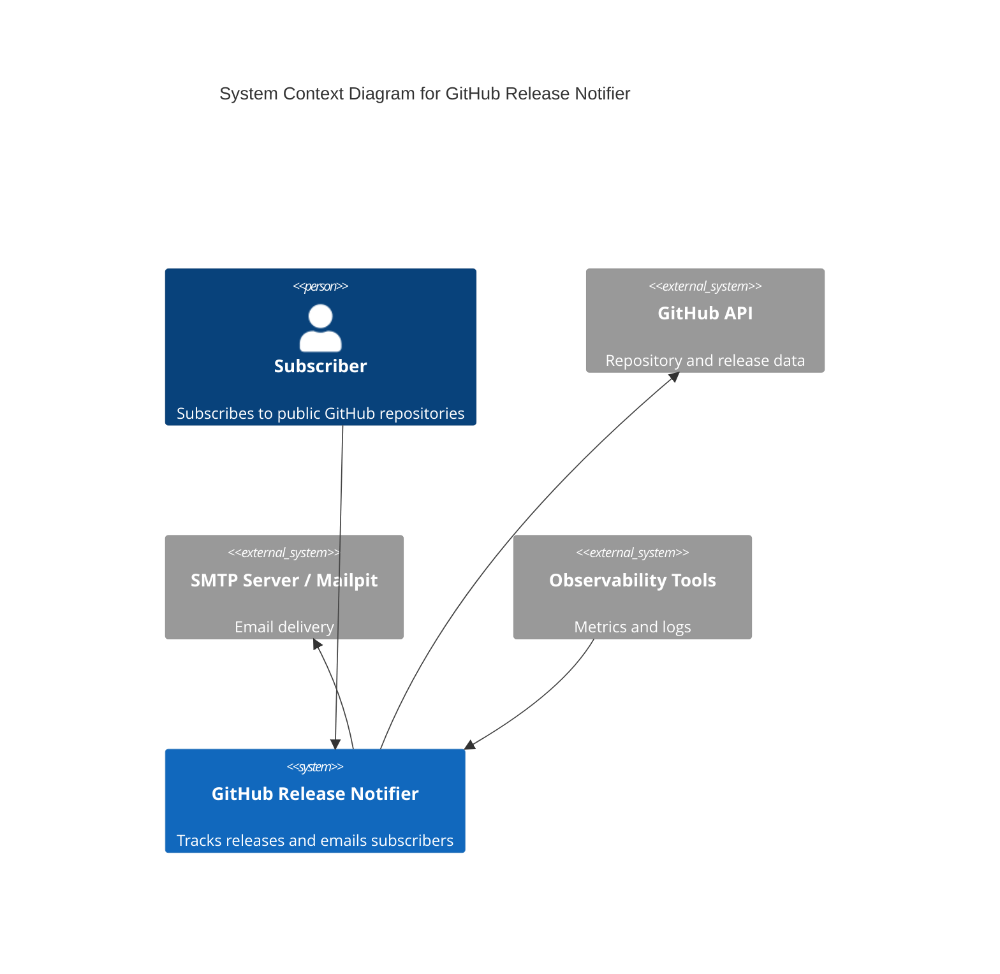
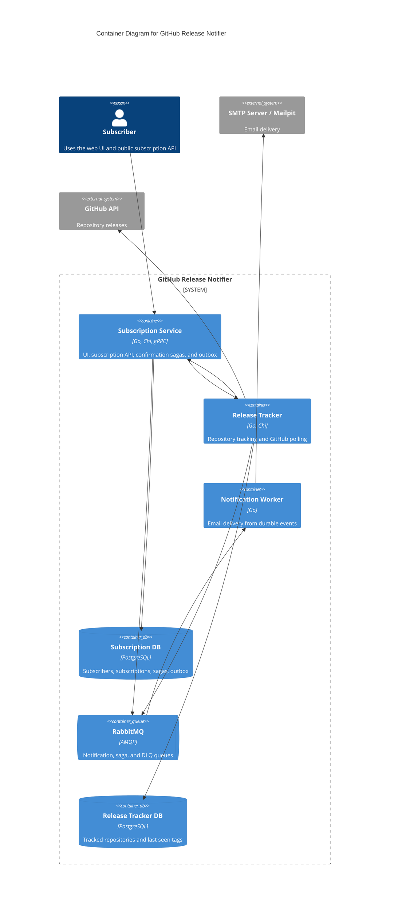
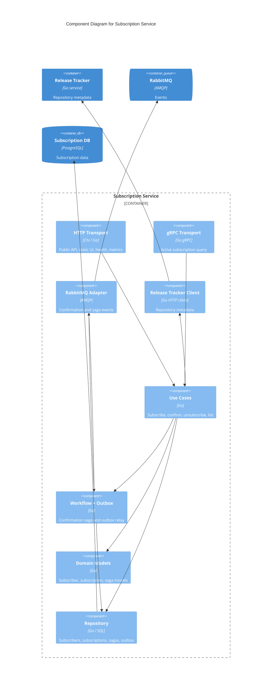
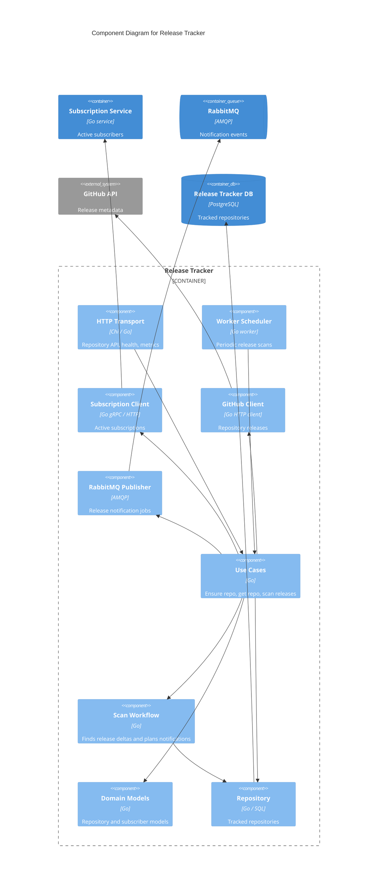
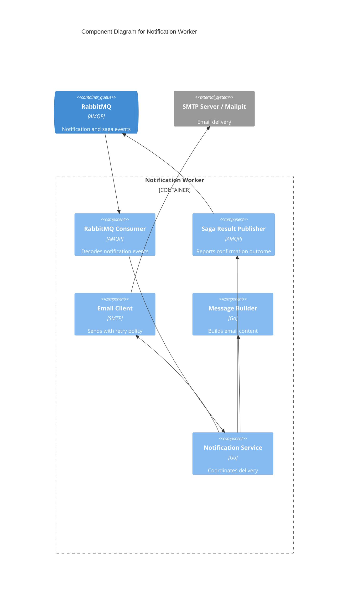

# Architecture

This document describes the current architecture of GitHub Release Notifier using the C4 model. The diagrams reflect the Docker Compose deployment and the Go modules under `services/` and `shared/`.

## Level 1: System Context

The system lets users subscribe to GitHub repositories, confirms subscriptions by email, periodically checks GitHub releases, and sends release notifications.

| From | To | Interaction |
| --- | --- | --- |
| Subscriber | GitHub Release Notifier | Uses web UI and subscription endpoints over HTTP |
| GitHub Release Notifier | GitHub API | Reads repository and release data over HTTPS/REST |
| GitHub Release Notifier | SMTP Server / Mailpit | Sends confirmation and release emails over SMTP |
| Observability Tools | GitHub Release Notifier | Reads metrics and logs |

## Level 2: Containers

The application is split into independently deployable services. Each stateful service owns its database. Cross-service business events use RabbitMQ, while synchronous repository and subscription queries use HTTP or gRPC.

| From | To | Interaction |
| --- | --- | --- |
| Subscriber | Subscription Service | Uses static UI and public subscription endpoints over HTTP |
| Subscription Service | Release Tracker | Ensures repositories and reads metadata over HTTP |
| Release Tracker | Subscription Service | Reads active subscribers over gRPC; HTTP adapter remains for comparison |
| Subscription Service | Subscription DB | Reads and writes subscribers, subscriptions, sagas, and outbox records over SQL |
| Release Tracker | Release Tracker DB | Reads and writes tracked repositories over SQL |
| Release Tracker | GitHub API | Polls latest release tags over HTTPS |
| Subscription Service | RabbitMQ | Publishes confirmation events and consumes saga results over AMQP |
| Release Tracker | RabbitMQ | Publishes release notification events over AMQP |
| Notification Worker | RabbitMQ | Consumes notification events and publishes saga results over AMQP |
| Notification Worker | SMTP Server / Mailpit | Sends emails over SMTP |

Observability containers are available through the Compose `observability` profile and scrape `/metrics` from the Go services.

## Code Architecture Style

At the system level, the application is split into independently deployable services. Each service owns its runtime process and, where needed, its own PostgreSQL database.

`subscription-service` and `release-tracker` use a modular ports-and-adapters style. Their business capabilities live under `internal/modules/...`; inside a module, transport adapters, use cases, workflows, domain models, and persistence stay close to the capability they serve. Use cases define application behavior and depend on local ports, while concrete PostgreSQL, RabbitMQ, GitHub, HTTP, and gRPC adapters are wired in `cmd/server`.

`notification-worker` is intentionally simpler because it has one main capability: notification delivery. It uses a thin application service in `internal/notification`, with SMTP and RabbitMQ adapters around it, instead of the full module structure used by the stateful services.

The dependency direction stays inward: transports and infrastructure adapters call use cases or application services, and domain models do not depend on infrastructure. The architecture lint configuration captures the most important import boundaries.

## Level 3: Subscription Service Components

The subscription service uses vertical module slices. Transport adapters call use cases, use cases depend on ports, and infrastructure adapters are wired in the composition root.

| From | To | Interaction |
| --- | --- | --- |
| HTTP Transport | Use Cases | Calls subscription use cases |
| gRPC Transport | Use Cases | Calls active-subscription query use case |
| RabbitMQ Adapter | Workflow + Outbox | Delivers saga result events |
| Release Tracker Client | Release Tracker | Calls repository APIs over HTTP |
| Use Cases | Domain Models | Uses subscription, subscriber, and saga models |
| Use Cases | Workflow + Outbox | Starts confirmation saga through a port |
| Use Cases | Repository | Reads and writes subscription state |
| Workflow + Outbox | Repository | Persists saga and outbox state |
| Workflow + Outbox | RabbitMQ Adapter | Publishes confirmation events |
| Repository | Subscription DB | Reads and writes data over SQL |
| RabbitMQ Adapter | RabbitMQ | Uses AMQP |

## Level 3: Release Tracker Components

The release tracker owns repository tracking and scanning. The subscription query client is selected in the composition root; gRPC is the current default and HTTP remains available for comparison.

| From | To | Interaction |
| --- | --- | --- |
| HTTP Transport | Use Cases | Calls repository ensure/read use cases |
| Worker Scheduler | Use Cases | Triggers periodic release scans |
| Subscription Client | Subscription Service | Calls gRPC by default; HTTP client is retained |
| GitHub Client | GitHub API | Calls GitHub over HTTPS |
| RabbitMQ Publisher | RabbitMQ | Publishes release notification jobs over AMQP |
| Use Cases | Domain Models | Uses repository and active-subscriber models |
| Use Cases | Scan Workflow | Finds release deltas and plans notifications |
| Use Cases | Repository | Reads and writes tracked repositories |
| Scan Workflow | Repository | Persists scan progress |
| Use Cases | GitHub Client | Checks repository existence and latest tags |
| Use Cases | Subscription Client | Requests active subscribers for changed repositories |
| Use Cases | RabbitMQ Publisher | Publishes release notification jobs |
| Repository | Release Tracker DB | Reads and writes data over SQL |

## Level 3: Notification Worker Components

The notification worker has no database. It consumes durable events, sends emails, and reports confirmation success or failure back to the subscription saga.

| From | To | Interaction |
| --- | --- | --- |
| RabbitMQ | RabbitMQ Consumer | Delivers notification events over AMQP |
| RabbitMQ Consumer | Notification Service | Dispatches decoded events |
| Email Client | SMTP Server / Mailpit | Sends email over SMTP |
| Saga Result Publisher | RabbitMQ | Publishes saga result events over AMQP |
| Notification Service | Message Builder | Builds email subject and body |
| Notification Service | Email Client | Sends email requests |
| Notification Service | Saga Result Publisher | Reports confirmation outcome |
