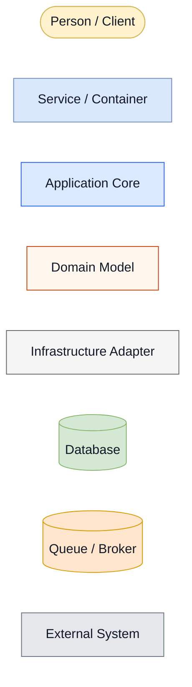
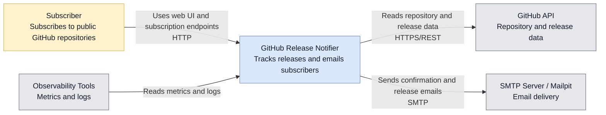
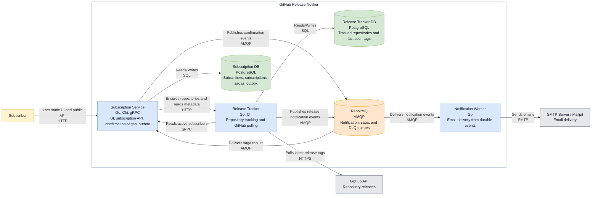
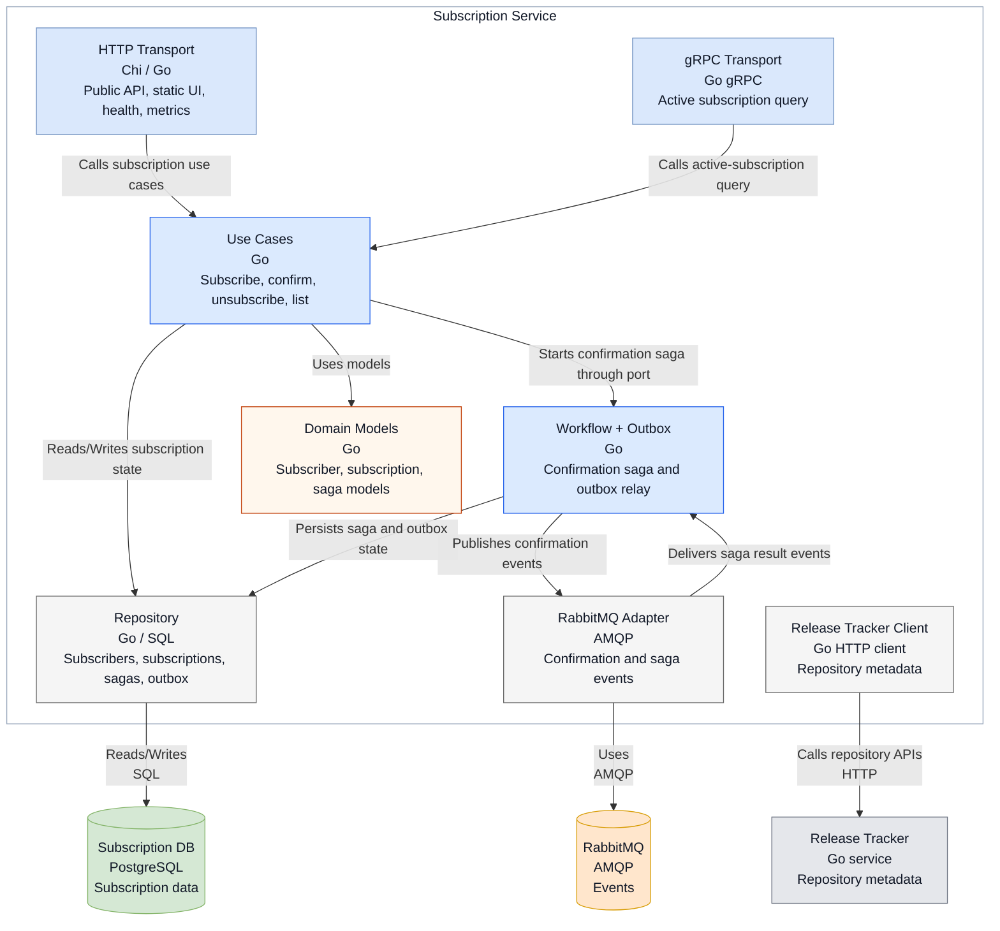
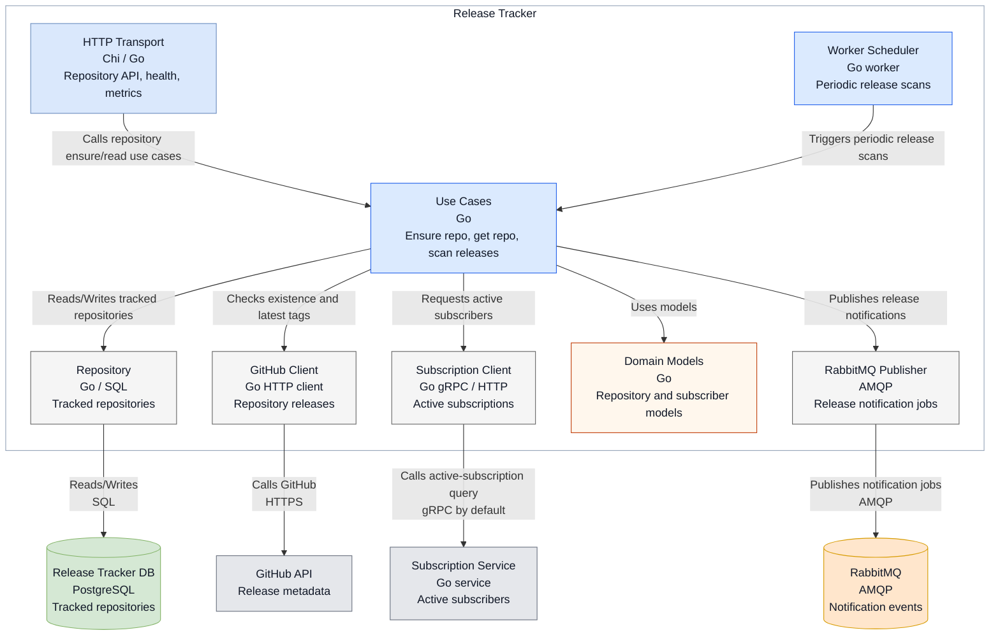
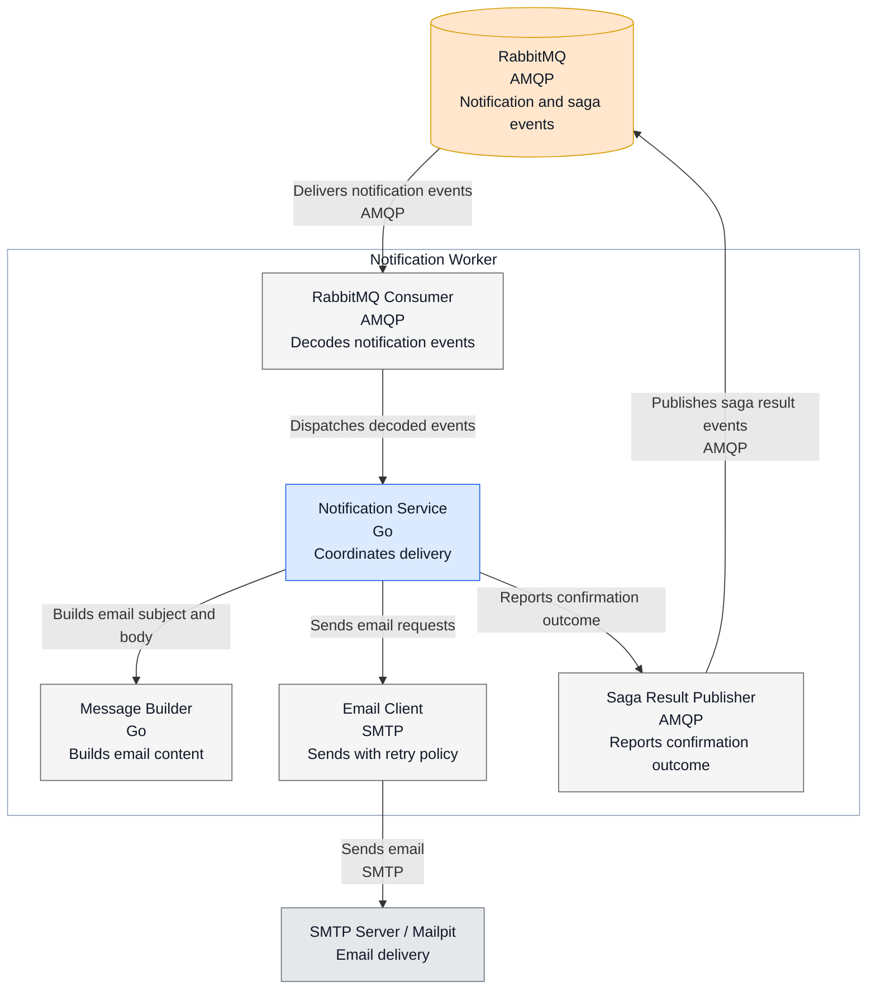

# Architecture

This document describes the current architecture of GitHub Release Notifier using the C4 model. The diagrams reflect the Docker Compose deployment and the Go modules under `services/` and `shared/`. The diagrams use Mermaid flowcharts for better rendering compatibility in Markdown, while the section levels still follow the C4 model.

## Diagram Legend

## Level 1: System Context

The system lets users subscribe to GitHub repositories, confirms subscriptions by email, periodically checks GitHub releases, and sends release notifications.

## Level 2: Containers

The application is split into independently deployable services. Each stateful service owns its database. Cross-service business events use RabbitMQ, while synchronous repository and subscription queries use HTTP or gRPC.

Observability containers are available through the Compose `observability` profile and scrape `/metrics` from the Go services.

## Level 3: Subscription Service Components

The subscription service uses vertical module slices. Transport adapters call use cases, use cases depend on ports, and infrastructure adapters are wired in the composition root.

## Level 3: Release Tracker Components

The release tracker owns repository tracking and scanning. The subscription query client is selected in the composition root; gRPC is the current default and HTTP remains available for comparison.

## Level 3: Notification Worker Components

The notification worker has no database. It consumes durable events, sends emails, and reports confirmation success or failure back to the subscription saga.

## Code Architecture Style

The system is split into independently deployable services. Each service owns its runtime process and, where needed, its own PostgreSQL database. Inside the stateful services, code is organized around business capabilities in a style similar to vertical slices. Each slice keeps its handlers, use cases, workflows, domain models, and persistence close together, while dependencies still point inward toward the application and domain code.

This is a pragmatic clean architecture / ports-and-adapters approach rather than a strict framework. `subscription-service` and `release-tracker` keep business slices under `internal/modules/...`. `notification-worker` is intentionally simpler: it has one application service in `internal/notification`, with SMTP and RabbitMQ adapters around it.

The intended dependency direction is inward:

| Layer | Responsibility | May depend on |
| --- | --- | --- |
| `cmd/server` | Composition root: loads config, creates databases, clients, adapters, use cases, servers, and workers | Any service-local layer |
| HTTP/gRPC transports and API routers | Accept external requests and translate transport DTOs into use-case calls | Use cases, domain models, support packages |
| Use cases and application services | Implement application behavior and define the ports they need | Domain models, local support packages, allowed shared event contracts |
| Workflows | Coordinate longer business processes such as confirmation saga and outbox publishing | Domain models, local ports, allowed shared event contracts |
| Domain models | Represent business state and rules | Other domain code only |
| Persistence | Store and load domain state from PostgreSQL | Domain models, database support |
| Infrastructure adapters | Implement ports for RabbitMQ, GitHub, SMTP, HTTP, and gRPC clients | Ports or domain models they adapt to |
| Support packages | Configuration, database bootstrap, observability, schedulers, migrations, and static assets | Other support code and explicitly allowed local layers |

The key rule is that domain and application code do not point outward to concrete infrastructure. For example, a domain model must not import PostgreSQL, RabbitMQ, HTTP, gRPC, or Prometheus. Use cases should depend on interfaces such as repositories, publishers, or external clients, while `cmd/server` wires those interfaces to concrete adapters.

The service-local `.go-arch-lint.yml` files make these boundaries executable. They define the layer components, allowed import directions, and vendor-import policy. Outer layers may use vendor packages freely, while domain packages cannot use vendor packages and application-core packages only allow the shared event contracts they publish or consume.
