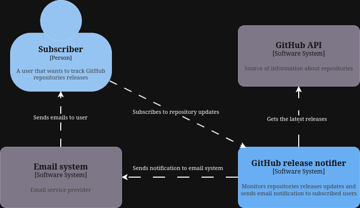
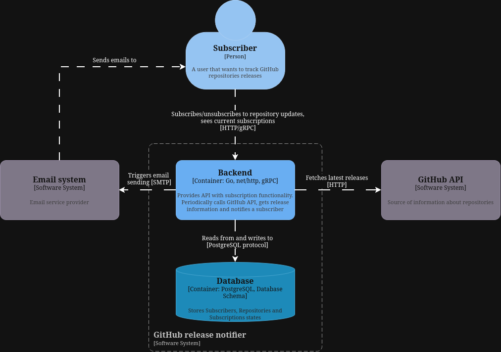
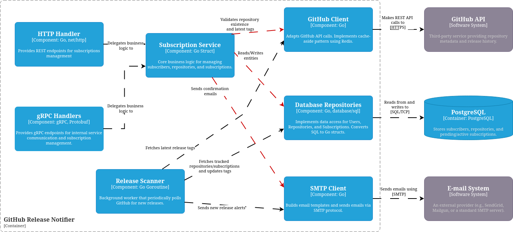

# System Design: GitHub Release Notifier

## 1. System Requirements

### Functional Requirements
- **Subscription**: Users can subscribe to any public GitHub repository using their email and repository name in `owner/repo` format.
- **Verification**: New subscriptions must remain in `Pending` status until the user confirms subscription via a unique token sent to their email.
- **List of Subscriptions**: Users must be able to see a list of all its subscriptions.
- **Release Scanning**: The system must periodically check GitHub for new releases of all tracked repositories.
- **Release Notification**: When a new release is detected, all confirmed subscribers of that repository must receive an email alert with specified tag and repo name.
- **Unsubscription**: Users must be able to unsubscribe from a specific repository using provided link or token.

### Non-functional Requirements
- **Reliability**: Release notifications must not be missed. The system should gracefully handle transient GitHub API or SMTP failures.
- **Observability**: Provide real-time metrics and structured logging.
- **Security**: Emails and confirmation tokens must be protected. Tokens should be cryptographically random and have a limited TTL.
- **Scalability**: The design should handle up to 10,000 active subscribers and 1,000 unique repositories without significant architectural changes.

### Constraints
- **Service Architecture**: Subscription management, release tracking, and notification delivery are independently deployable services.
- **GitHub API Limits**: The system must operate within GitHub's rate limits (60/hr for unauthenticated, 5,000/hr for authenticated requests).
- **Environment**: Must be containerized and with ability to run whole system using Docker Compose.

## 2. Load Estimation

### Users and Traffic
- **User Base**: Assume 10,000 active subscribers, each watching an average of 5 repositories.
- **Scanning Frequency**: 1,000 unique repositories scanned every 10 minutes.
- **Inbound Traffic (API)**: Very low. Primarily subscription creations and confirmations (~10-50 per hour).
- **Outbound Traffic (Scanner)**: 1,000 repositories / 600 seconds = ~1.6 Requests Per Second (RPS) to the GitHub API. This is well within the 5,000/hr limit for authenticated tokens.
- **Notifications**: Assuming 1 release per repository per week, the system will send ~10,000 emails per week (approx. 1 email per minute on average).

### Data Storage
- **Subscribers**: 10,000 rows (Email, CreatedAt). ~1 MB.
- **Repositories**: 1,000 rows (Name, LastSeenTag). ~0.5 MB.
- **Subscriptions**: 50,000 rows (SubID, RepoID, Token, Status). ~10 MB.
- **Total DB Size**: Under 100 MB for the first year, easily fitting within the memory of a standard PostgreSQL container.

## 3. High Level Architecture

The system has a subscription API, a release tracker, and a notification worker. The subscription service calls the release tracker over HTTP for repository metadata. The release tracker keeps both REST and gRPC adapters for synchronous subscription queries, with gRPC selected in the composition root. Notification delivery remains asynchronous through RabbitMQ.

The production codebase mirrors those boundaries with separate Go modules under `services/subscription-service`, `services/release-tracker`, and `services/notification-worker`, plus shared event and messaging modules. Each stateful service owns its PostgreSQL database.

### 3.1 C4 Diagrams

#### Level 1: System Context Diagram
Shows the GitHub Release Notifier in relation to users and external systems.

> [!TIP]
> The diagram above is an "Editable PNG". To modify it, download the file and drag it into [drawio](https://drawio.com/).

#### Level 2: Container Diagram
Shows the shows the high-level shape of the software architecture and how responsibilities are distributed across it.

> [!TIP]
> The diagram above is an "Editable PNG". To modify it, download the file and drag it into [drawio](https://drawio.com/).

#### Level 3: Component Diagram
Shows the internal structure of the Go workspace and its interactions.

> [!TIP]
> The diagram above is an "Editable PNG". To modify it, download the file and drag it into [drawio](https://drawio.com/).

## 4. Detailed Design of Components

### 4.1 API Layer

#### Responsibility
Acts as the primary entry point, responsible for translating transport-level requests into domain logic while maintaining strict isolation.

- **Request Parsing**: Parses JSON payloads and extracts URL parameters.
- **Routing**: Directs requests to handlers.
- **Delegation**: Adapts transport data into models for the Service Layer.
- **Observability**: Exposes metrics.

#### Endpoints
- **POST `/api/v1/subscribe`**: Create a pending subscription.
- **GET `/api/v1/confirm/{token}`**: Confirm ownership via email token.
- **GET `/api/v1/unsubscribe/{token}`**: Remove a specific subscription.
- **GET `/api/v1/subscriptions?email={email}`**: List user's subscriptions.
- **GET `/metrics`**: Prometheus metrics endpoint.

### 4.2 Service Layer

#### Responsibility
The core orchestrator that enforces business rules and manages state transitions between data and external integrations.

- **Domain Orchestration**: Coordinates multi-step workflows like repository verification.
- **Lifecycle Management**: Controls subscription states (Pending, Active, Deleted).
- **Background Coordination**: Manages the periodic scan and notification loop.

### 4.3 Repository Layer

#### Responsibility
An abstraction for the PostgreSQL database, providing a clean data access interface.

- **Data Encapsulation**: Hides SQL implementation details from business logic.
- **Relational Integrity**: Enforces consistency across the normalized schema.
- **Atomic Operations**: Uses transactions to ensure safe concurrent updates.

### 4.4 External Clients

#### Responsibility
Adapters that handle protocol-specific logic and resilience patterns for 3rd-party services.

- **GitHub Client**: Manages REST API communication with rate-limit awareness.
- **Event Bus Adapter**: Publishes notification jobs to RabbitMQ through an application-facing port.
- **Notifier (SMTP)**: Runs in the notification worker and handles email template rendering and SMTP delivery.

### 4.5 Notification Worker

#### Responsibility
Consumes durable notification jobs from RabbitMQ and delivers them through SMTP.

- **Message Consumption**: Reads subscription confirmation and release notification jobs.
- **Delivery**: Builds email subjects/bodies and sends messages through SMTP.
- **Acknowledgement**: Acknowledges RabbitMQ messages only after successful SMTP delivery.
- **Failure Handling**: Failed messages are rejected into a dead-letter queue for inspection.

## 5. Core Workflows

### 5.1 Subscription Flow
1. **Request**: User submits email and repository name.
2. **Validation**: Service verifies repository format and queries GitHub API for existence.
3. **Persist**: 
    - Subscriber record created (if new).
    - Release tracker ensures the repository over internal HTTP and stores its latest tag in its own database.
    - Pending Subscription created with a random 32-character token.
4. **Publish**: The core service publishes a `SubscriptionConfirmationRequested` event to RabbitMQ.
5. **Notify**: The notification worker consumes the event and sends a confirmation email.

### 5.2 Notification Flow (Scanner)
1. **Wake**: Scanner ticker triggers every `X` minutes.
2. **Scan**:
    - Fetches all repositories with active subscribers.
    - Queries GitHub API for each repository's latest release.
    - Compares `latest_tag` with database `last_seen_tag`.
3. **Plan & Publish**:
    - If a delta is found, fetch all active subscribers for that repo.
    - Publish one `ReleaseNotificationRequested` job per subscriber.
    - Update `last_seen_tag` after notification jobs have been published.
4. **Notify**:
    - The notification worker consumes the jobs and sends release alerts through SMTP.

## 6. Observability
- **Logging**: Structured JSON logging (via `slog`) for easy ingestion into ELK/Loki.
- **Metrics**: A `/metrics` endpoint exposing basic app metrics.
